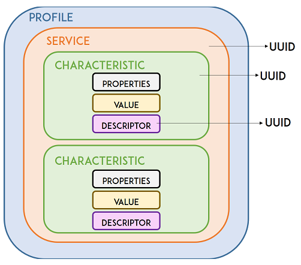

# How to setup test config for native_sim tests while needed a shell prompt?

### Table of Contents
1. [Zephyr application - home page](../README.md)
2. [Add new board to project](Add_new_board_to_project.md)
3. [Artifactory storage server](Artifactory_storage_server.md)
4. [GitHub workflow_dispatch panel](Github_workflow_dispatch_panel.md)
5. [HW resources for tests](HW_resources_for_tests.md)
6. [Kconfig tester guide](Kconfig_tester_guide.md)
7. [Raspi runner installation](Raspi_runner_installation.md)
8. [Shell tests with native_sim](Shell_tests_with_native_sim.md)
9. [Tests list](Tests_list.md)
10. [Tests user guide](Tests_user_guide.md)
11. [MCUmgr subsystem for testing purposes](MCUmgr_subsystem_for_testing_purpose.md)
12. [Simulation/emulation principles in testing](Simulation_emulation_principles.md)
13. BLE terms, roles and definitions [this page]
---

To have an effective custom implementation, it is important to understand how a BLE connection works, what roles are played by the devices involved, and how data is transferred from one device to the other over the air. Many terms are used, they are usually not interchangeable, and mean different things: central, peripheral, client, server, advertise, scan, read, write, notify, and indicate. Understanding the terminology will make it easier to describe and build your BLE application.

<br/>

TEMINOLOGY
<table>
    <thead>
      <th><strong>NAME</strong></th>
      <th><strong>DESCRIPTION</strong></th>
    </thead>
      <tbody>
        <tr>
        <td>GAP</td>
        <td>GAP is an acronym for the <strong>Generic Access Profile</strong> - it controls connections and advertising in Bluetooth. GAP defines various roles for devices, but the two key concepts to keep in mind are "Central" devices and "Peripheral" devices.</td>
        </tr>
        <tr><td><a href="#gatt">GATT</a></td>
        <td>GATT is an acronym for the Generic ATTribute Profile, and it defines the way that two BLE devices send and receive standard messages.</td>
        </tr>
        <tr><td><a href="#uuid">UUID</a></td>
        <td>Each service, characteristic, and descriptor have a UUID (Universally Unique Identifier).</td>
        </tr>
</table>
<br/>
CONNECTION ROLES
<table>
    <thead>
      <th><strong>ROLE</strong></th>
      <th><strong>DESCRIPTION</strong></th>
    </thead>
      <tbody>
        <tr>
        <td><a href="#central-peripheral">Central (Master)</a></td>
        <td>Initiates and manages connections to Peripheral devices (pre-connection).</td>
        </tr>
        <tr><td><a href="#central-peripheral">Peripheral (Slave)</a></td>
        <td>Advertises its presence and waits for a Central to connect to (pre-connection).</td>
        </tr>
        <tr>
        <td><a href="#server-client">Server</a></td>
        <td>A server has a local database of resources (profiles/services/characteristics), it provides resources to the remote client (post-connection, GATT).</strong></td>
        </tr>
        <tr><td><a href="#server-client">Client</a></td>
        <td>A client accesses remote resources (post-connection, GATT).</td>
        </tr>
</table>

<br/>

## <a id="central-peripheral"></a>Connection Roles - Central vs. Peripheral
BLE roles are split into pre-connection and post-connection. Pre-connection: At startup a device is either <strong>a Peripheral or a Central</strong>.
- Central (Master) - the BLE device which initiates an outgoing connection request to an advertising peripheral device.
- Peripheral (Slave) - the BLE device which accepts an incoming connection request after advertising.

The BLE specification does not limit the number of Peripherals a Central may connect to. BLE Peripheral can only be connected to one central device (a mobile phone, etc.) at a time! As soon as a peripheral connects to a central device, it will stop advertising itself and other devices will no longer be able to see it or connect to it until the existing connection is broken.

<br/>

## <a id="server-client"></a>Connection Roles - Server vs. Client
Post-connection: important concept in a BLE design is the difference between <strong>a GATT server and a GATT client</strong>.
- Server - can send data to the client without a read/write request using indicate and notify operations. Server devices have a local database and access control methods, and provide resources to the remote client.
- Client - sends read and write operations to the server, and the server responds with data (and changes its local data if appropriate). Client devices access remote resources over a BLE link using the GATT protocol. 

Unlike the master/slave distinction defined previously, it is easy to see that one device might actually be both of these things at the same time, based on how your application defines the data structure and flow for each side of the connection. While it is most common for the slave (peripheral) device to be the GATT server and the master (center) device to be the GATT client, this is not required. The GATT functionality of a device is logically separate from the master/slave role.

<br/>

## <a id="gatt"></a>GATT
GATT defines a hierarchical data structure that is exposed to connected BLE devices. This means that GATT defines the way that two BLE devices send and receive standard messages. Bluetooth Low Energy devices transfer data back and forth using concepts called "Services" and "Characteristics".

<br/>



<br/>

- Profile: standard collection of services for a specific use case;
- Service: collection of related information, like sensor readings, battery level, heart rate, etc. ;
- Characteristic: it is where the actual data is saved on the hierarchy (value);
- Descriptor: metadata about the data;
- Properties: describes how the characteristic value can be interacted with. For example: read, write, notify, broadcast, indicate, etc.

<br/>

## <a id="uuid"></a>UUID
A UUID (Universally Unique Identifier) is a unique 128-bit (16 bytes) number. For example:

```c
55072829-bc9e-4c53-938a-74a6d4c78776
```

UUID is used for uniquely identifying information - there are shortened default UUIDs for all types, services, and profiles specified in the SIG (Bluetooth Special Interest Group) - international standards development organization responsible for Bluetooth® technology. See [UUIDs - Assigned Numbers](https://www.bluetooth.com/specifications/assigned-numbers/). 

Example: UUIDs for the temperature, humidity, and pressure are:

```c
pressure: 0x2A6D
temperature: 0x2A6E
humidity: 0x246F
```
