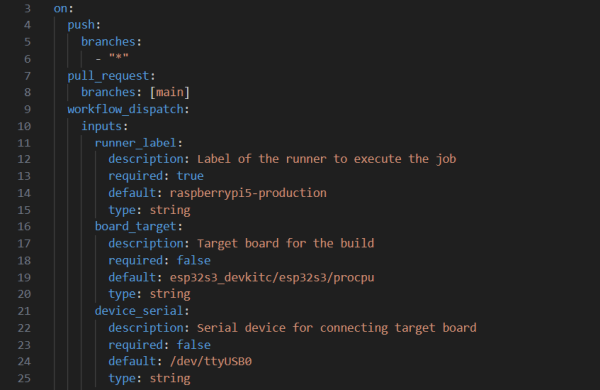
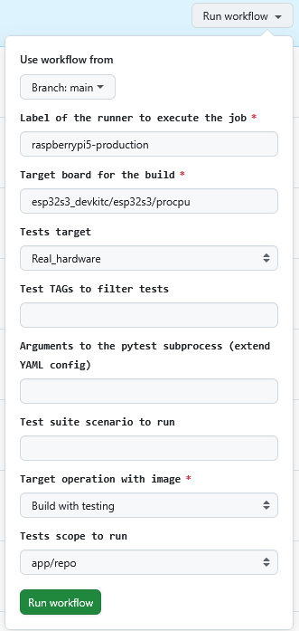

# GitHub workflow\_dispatch panel

A **workflow** is a configurable automated process that will run one or more jobs. Workflows are defined by a YAML file checked in to your repository and will run when triggered by an event in your repository, or they can be triggered manually, or at a defined schedule.

**Workflow Dispatch** is a trigger in GitHub Actions that allows you to manually start a workflow. To run a workflow manually, the workflow must be configured in .yml file to run on the `workflow_dispatch` event. When a workflow is configured to run on the `workflow_dispatch` event, you can run the workflow using the Actions tab on GitHub, GitHub CLI, or the REST API. To trigger the `workflow_dispatch` event, your workflow must be in the default branch (main)!<br/>
<br/>

## How to get into workflow UI panel

For basic guideline how to find and trigger workflow manually see the official GitHub page:  
[https://docs.github.com/en/actions/how-tos/manage-workflow-runs/manually-run-a-workflow](https://docs.github.com/en/actions/how-tos/manage-workflow-runs/manually-run-a-workflow)

To utilize the `workflow_dispatch` event, you need to add it to your repository workflow file in the `.github/workflows/build.yml`. Here is a basic example (extract) from build.yml file at the time of writing this guide:<br/>
<br/>



<br/>
The UI output of this implementation is generated  in GitHub repository after the work branch is merged to default branch. Find the UI by clicking on main menu "Actions" -> left menu "Build" -> click on \<Run workflow> button:<br/>
<br/>
<br/>


<br/>
The UI for an user updates shows after clicking on the \<Run workflow> button:<br/>
<br/>
<br/>


<br/>
<br/>


## How to trigger workflow dispatch event manually

To manually trigger a workflow:

1.  Navigate to GitHub Actions section where the workflow button is available.
2.  Select the workflow you want to run.
3.  Click on \<Run workflow> button.
4.  Fill in any input parameters if required.
5.  Confirm your setup and trigger event by clicking on \<Run workflow> button at the bottom on UI panel.<br/>
<br/>

## Description of input parameters in workflow UI panel

Workflow dispatch panel allows to use 4 types of inputs: `string`, `choice`, `boolean`, and `environment.` Based on input type, the user can enter the parameter value directly as a string (string, boolean, environment) or choose from pre-defined dropdown menu (choice). The meanings and rules to fill in correct input parameters to UI panel are mentioned in next table:<br/>
<br/>
<br/>

<table>
    <thead>
      <tr><th><strong>Field title</strong></th>
      <th><strong>Description</strong></th>
      <th><strong>Parameter to enter</strong></th></tr>
    </thead>
      <tbody>
        <tr><td>Use workflow from</td><td>Git branch/Tag, on which the workflow event is triggered and workflow jobs are started. Despite this field is "string" type, the existing GitHub branches are provided in secondary dropdown menu. By entering a string the demanded branch is filtered from all available branch names.</td><td>Branch name/tag by entering a string &amp; selecting branch/tag in dropdown menu.<br><br><strong>[STRING]</strong></td>
        </tr>
        <tr><td>Label of the runner to execute the job</td><td><a href="https://docs.github.com/en/actions/how-tos/manage-runners/self-hosted-runners/apply-labels">GitHub runner</a> on which the workflow jobs running. It can be GitHub-hosted runner (not recommended due to the restricted quota) or self-hosted runner (must be registered and pre-installed in advance).</td><td>String with runner-label matching the registered runner in GitHub. Only 1 single string is allowed!<br><br><strong>[STRING]</strong><br><strong>Default = raspberrypi5-production</strong><br><strong>Example = vmware-test</strong></td></tr>
        <tr><td>Target board for the build</td><td>Target board Zephyr qualifier (Device Under Test = DUT): The set of additional tokens, separated by a forward slash (<code>/</code>) that follow the <a href="https://docs.zephyrproject.org/latest/glossary.html#term-board-name">board name</a> (and optionally <a href="https://docs.zephyrproject.org/latest/glossary.html#term-board-revision">board revision</a>) to form the <a href="https://docs.zephyrproject.org/latest/glossary.html#term-board-target">board target</a>. The currently accepted qualifiers are <a href="https://docs.zephyrproject.org/latest/glossary.html#term-SoC">SoC</a>, <a href="https://docs.zephyrproject.org/latest/glossary.html#term-CPU-cluster">CPU cluster</a> and <a href="https://docs.zephyrproject.org/latest/glossary.html#term-variant">variant</a>. See <a href="https://docs.zephyrproject.org/latest/hardware/porting/board_porting.html#board-terminology">Board terminology</a> in Zephyr RTOS for additional details.</td><td>Target platform/board qualifier to be build &amp; tested. Only 1 single string is allowed!<br><br><strong>[STRING]</strong><br><strong>Default = esp32s3_devkitc/esp32s3/procpu</strong><br><strong>Example = nrf5340dk/nrf5340/cpuapp</strong></td></tr>
        <tr><td>Serial device for connecting target board</td><td>Serial port in OS where the DUT is connected to. Depends on the host operating system.</td><td>Serial port for connection the DUT. Only 1 single string is allowed!<br><br><strong>[STRING]</strong><br><strong>Default = /dev/ttyUSB0</strong><br><strong>Example = /dev/ttyACM0&nbsp;</strong></td></tr>
        <tr><td>Test TAGs to filter tests</td><td><p><a href="https://docs.zephyrproject.org/latest/develop/test/twister.html">Test tag(s)</a> - tags to restrict which tests to run by tag value. Default is to not do any tag filtering. &nbsp;Multiple invocations are treated as a logical 'or' relationship. Test tags are located in sample.yaml or testcase.yaml files within the tests-section.&nbsp;<br><strong>Example:</strong></p>tests:
        testing.ztest.base.verbose_0_userspace:
          filter: CONFIG_ARCH_HAS_USERSPACE
          extra_args: CONF_FILE=prj_verbose_0.conf
          tags:
            - userspace
          extra_configs:
          - CONFIG_TEST_USERSPACE=y</td><td>Test tags to filter demanded tests to run. Multiple strings separated by space are allowed!<br><br><strong>[STRING]</strong><br><strong>Default = N/A</strong><br><strong>Example = unit sanitary&nbsp;</strong></td></tr>
          <tr><td>Pattern to filter specific tests (regex)</td><td>The <a href="https://docs.zephyrproject.org/latest/develop/test/twister.html">test pattern</a> to select demanded tests. The twister command runs only the tests matching the specified pattern. The pattern can include<strong> regular expressions!</strong></td><td>Test pattern (incl. REGEX) to filter demanded tests to run. Only 1 single string is allowed!<br><br><strong>[STRING]</strong><br><strong>Default = N/A</strong><br><strong>Example = shell.*vt100</strong></td></tr>
          <tr><td>Arguments to the pytest subprocess (extend YAML config)</td><td><a href="https://docs.zephyrproject.org/latest/develop/test/twister.html">Additional arguments</a> for Pytest subprocess. This parameter will extend the pytest_args from the harness_config in YAML file.&nbsp;<br><strong>Example:</strong><br><code>--pytest-args "--maxfail=2 --disable-warnings"</code><br><br>This will run Twister and pass the arguments --maxfail=2 --disable-warnings to the pytest subprocess, limiting failures to 2 and disabling warnings output.</td><td>Option(s) to be forwarded to pytest subprocess when running Twister tests. Multiple strings separated by space are allowed! Prepend "--" before each option.<br><br><strong>[STRING]</strong><br><strong>Default = N/A</strong><br><strong>Example = --maxfail=2 &nbsp;--disable-warnings</strong></td></tr>
          <tr><td>Test suite scenario to run</td><td><p>Each testsuite can consist of multiple <a href="https://docs.zephyrproject.org/latest/develop/test/twister.html">test scenarios.</a> This parameter allows to filter specific scenario to run while other scenarios in the same test suite are ignored.</p><p>Scenarios are named by 'path/relative/to/Zephyr/base/section.subsection_in_testcase_yaml', or just 'section.subsection' identifier. See an example for scenario "esp.wifi.sec.wpa2":</p>
            <code>esp.wifi.sec.none:
              tags: wifi
              filter: CONFIG_WIFI_ESP32
              extra_configs:
                - CONFIG_ESP32_WIFI_STA_AUTO_DHCPV4=y
              platform_allow:
                - esp32_devkitc/esp32/procpu
                - esp32s2_saola
            esp.wifi.sec.wpa2:
              tags: wifi
              filter: CONFIG_WIFI_ESP32
              extra_configs:
                - CONFIG_WIFI_TEST_AUTH_MODE_WPA2=y
                - CONFIG_ESP32_WIFI_STA_AUTO_DHCPV4=y
              platform_allow:
          - esp32_devkitc/esp32/procpu</code></td><td><p>Test scenario name to filter when running the testcase. Only 1 single string is allowed!<br><strong>Note:&nbsp;</strong><br>to find the demanded test scenario faster in search process, select the respective "Test scope to run" folder, where the scenario exists, in next option!</p><p><strong>[STRING]</strong><br><strong>Default = N/A</strong><br><strong>Example = esp.wifi.sec.wpa2</strong></p></td></tr>
          <tr><td>Tests scope to run</td><td><p>Select the target folder, where the search proces looks for all test suites located there to run. Test suite is identified by existing project file prj.conf. In case the Test suite scenario parameter is used, the selected folder path is assigned to argument <strong>"--testsuite-root"</strong> in twister command and thus the looking for demanded scenarion is faster. In this case only demanded test scenario is selected to run with twister command and other test suites/test cases are ignored!</p><p>Mapping UI field -&gt; GitHub application folder (note that the native Zephyr RTOS tests in zephyr/tests/ workspace can be selected too): &nbsp;</p>
          <code>app/repo -&gt; __w/antoskape-project/antoskape-project/customer-application/tests/repo
        app/integration -&gt; __w/antoskape-project/antoskape-project/customer-application/tests/integration
        app/unit -&gt; __w/antoskape-project/antoskape-project/customer-application/tests/unit
        app(all tests) -&gt; __w/antoskape-project/antoskape-project/customer-application/tests
        zephyr(all tests) -&gt; __w/antoskape-project/antoskape-project/zephyr/tests</code></td><td>Target folder where all test cases are selected to run with twister command. This path is assigned to "--testsuite-root" argument if Test suite scenario is filled in previous parameter. Only 1 single string is allowed!<br><br><strong>[CHOICE]</strong><br><strong>Default = app/repo</strong><br><strong>Example = app/unit</strong></td></tr>
      </tbody>
</table>
<br/>

## Twister command examples

This GitHub repository workflow has implemented the following Twister command skeleton with respect to workflow dispatch trigger parameters available:

"Test suite scenario to run" parameter is not filled (empty field) . All test suites from desired folder are selected to run.

```
west twister -vv --platform esp32s3_devkitc/esp32s3/procpu \
    --device-testing --device-serial /dev/ttyUSB0 \
    --west-flash \
    --flash-before \
    --tag net --force-tags 
    --test-pattern  shell.*vt100 \
    --pytest-args "--maxfail=2 --disable-warnings" \
    -T tests/repo
```

"Test suite scenario to run" parameter is filled with scenario-string. All test suites/test cases from desired folder are ignored except the demanded test scenario, which will run with "west twister" command.

```
west twister -vv --platform esp32s3_devkitc/esp32s3/procpu \
    --device-testing --device-serial /dev/ttyUSB0 
    --west-flash \
    --flash-before \
    --tag net --force-tags \
    --test-pattern  shell.*vt100 \
    --pytest-args "--maxfail=2 --disable-warnings" \
    --scenario sample.pytest.shell \
    --testsuite-root tests/repo
```