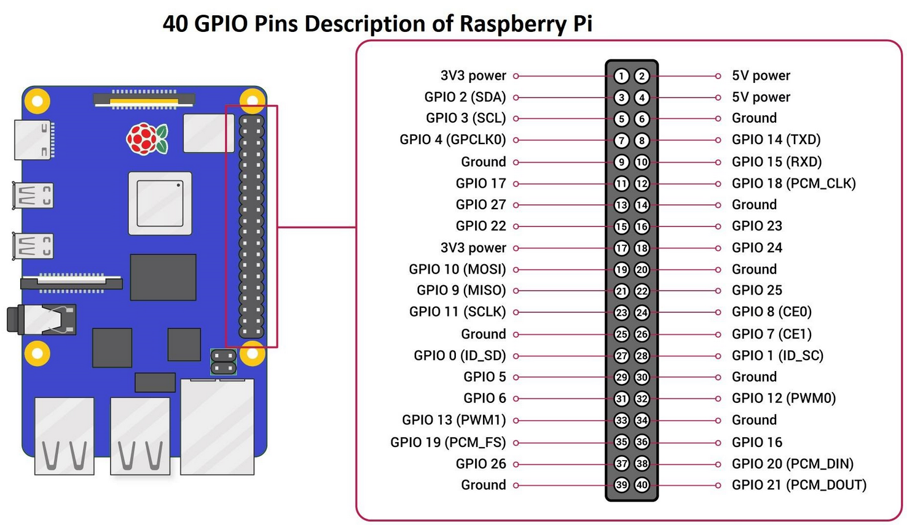
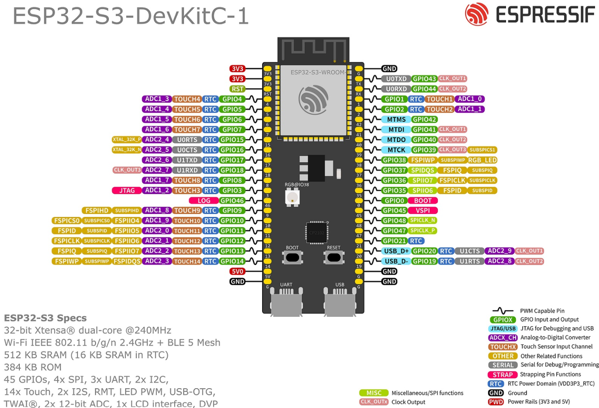

# HW resources for tests

Several test case executed on real board hardware are using an external HW resources for verification the physical signals returned from tested boards. The following table lists the mandatory HW resources for tests. In case these resources are not provided and connected to test bench, the respective test case will fail. 
 

 

<table>
    <thead>
      <th><strong>TEST PATH</strong></th>
      <th><strong>REQUIRED RESOURCES</strong></th>
      <th><strong>PURPOSE</strong></th></tr>
    </thead>
      <tbody>
        <tr>
        <td>tests/repo_tests/power_cycle_boot</td>
        <td>Raspberry Pi 5, GPIO 25</strong></td>
        <td>Control power off/on relay.</strong></td>
        </tr>
        <tr><td>tests/repo_tests/pwm_ledc</td>
        <td>Raspberry Pi 5, GPIO 24</td>
        <td>Measure PWM signal - frequency and duty cycle.</strong></td>
        </tr>
        <tr><td>tests/repo_tests/gpio_toggle_pytest</td>
        <td>ESP32 S3 devkitc, GPIO 9 (Device Under Test)</td>
        <td>Verify tested GPIO pin status after toggling.</strong></td>
        </tr>
      </tbody>
</table>
 

## Documents

 

Pic.1. Raspberry Pi 5 pinouts.
 

 

Pic.2. ESP32 S3 Devkitc pinouts.
 
