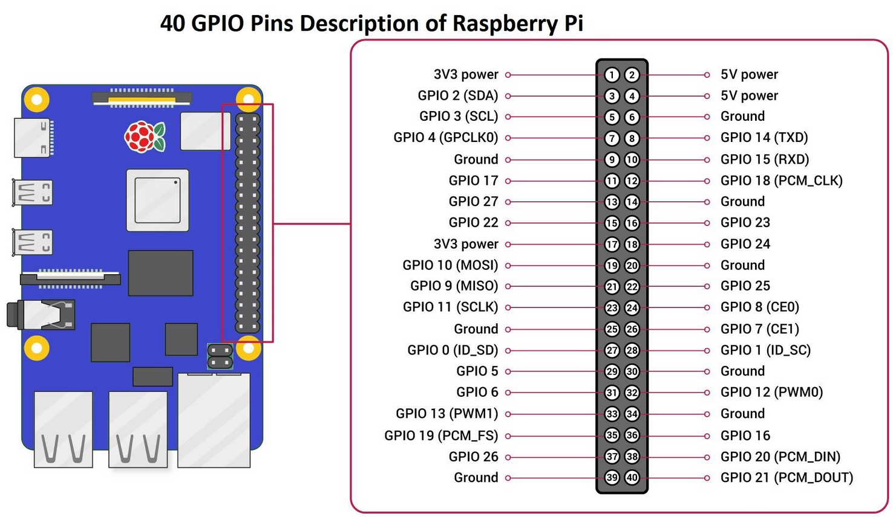
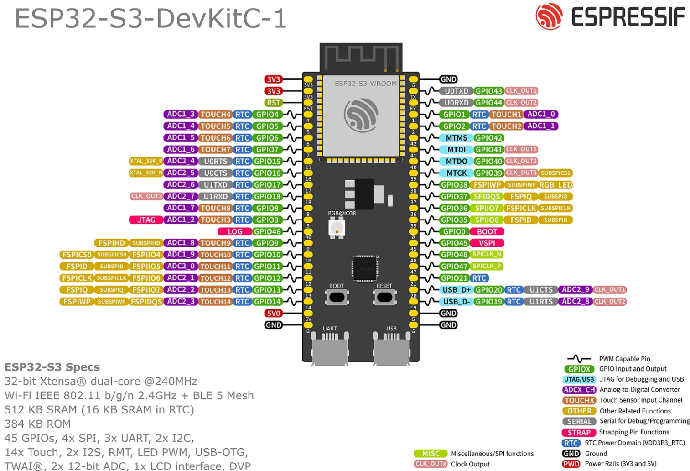

# HW resources for tests

### Table of Contents
1. [Zephyr application - home page](../README.md)
2. [Add new board to project](Add_new_board_to_project.md)
3. [Artifactory storage server](Artifactory_storage_server.md)
4. [GitHub workflow_dispatch panel](Github_workflow_dispatch_panel.md)
5. HW resources for tests [this page]
6. [Kconfig tester guide](Kconfig_tester_guide.md)
7. [Raspi runner installation](Raspi_runner_installation.md)
8. [Shell tests with native_sim](Shell_tests_with_native_sim.md)
9. [Tests list](Tests_list.md)
10. [Tests user guide](Tests_user_guide.md)
11. [MCUmgr subsystem for testing purposes](MCUmgr_subsystem_for_testing_purpose.md)
12. [Simulation/emulation principles in testing](Simulation_emulation_principles.md)
13. [BLE terms, roles and definitions](BLE_terms_definitions.md)
---

Multiple test case executed on real board hardware are utilizing an external HW resources for verification the physical signals returned from the tested boards. The following table lists the mandatory HW resources for tests. In case these resources are not provided and correctly connected to test bench, the respective test case will fail.

For complete list of all tests in this repository follow this link: <a href="documentation/Tests_list.md">Tests list</a>.

 

<table>
    <thead>
      <th><strong>TEST PATH</strong></th>
      <th><strong>REQUIRED RESOURCES</strong></th>
      <th><strong>PURPOSE</strong></th></tr>
    </thead>
      <tbody>
        <tr>
        <td>tests/repo_tests/general_tests/power_cycle_boot</td>
        <td>Raspberry Pi 5, GPIO 25.</td>
        <td>Control power off/on relay.</td>
        </tr>
        <tr><td>tests/repo_tests/general_tests/pwm_ledc</td>
        <td>Raspberry Pi 5, GPIO 24.</td>
        <td>Measure PWM signal - frequency and duty cycle.</td>
        </tr>
        <tr><td>tests/repo_tests/shell_tests/gpio_toggle_pytest</td>
        <td>ESP32 S3 devkitc, GPIO 9 (Device Under Test).</td>
        <td>Verify tested GPIO pin status after toggling.</td>
        </tr>
        <tr><td>tests/repo_tests/shell_tests/ble_shell_central</td>
        <td>Second compatible BLE board or BLE enabled device that can act as a Peripheral - e.g. iPhone with <strong>nRF Connect</strong> application. 
        (https://apps.apple.com/us/app/nrf-connect-for-mobile/id1054362403)</td>
        <td>Create new Peripheral BT device to be connected from DUT.</td>
        </tr>
      </tbody>
</table>
 

## Technical documents

 

Pic.1. Raspberry Pi 5 pinouts.
 

 

Pic.2. ESP32 S3 Devkitc pinouts.
 
