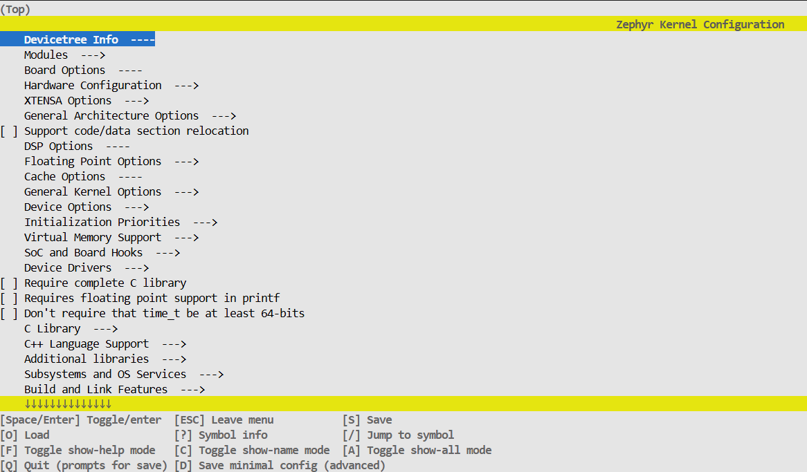
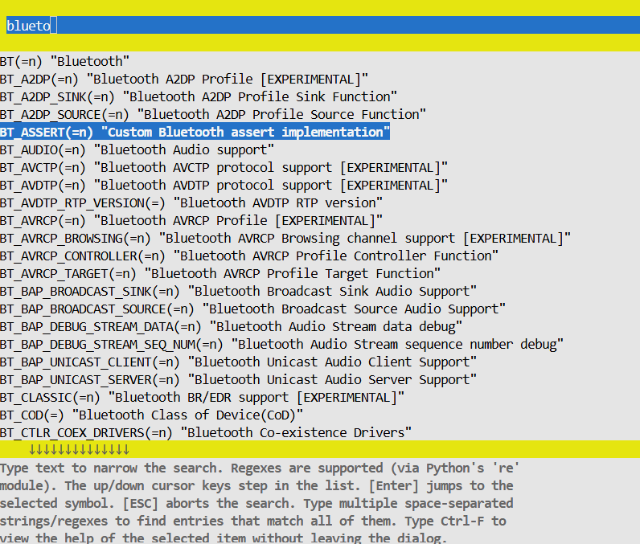
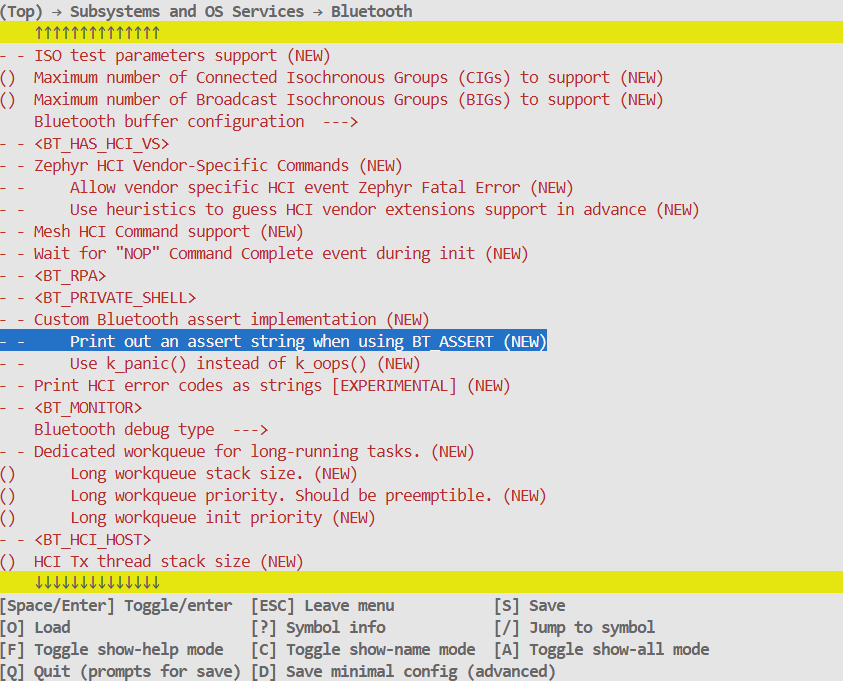
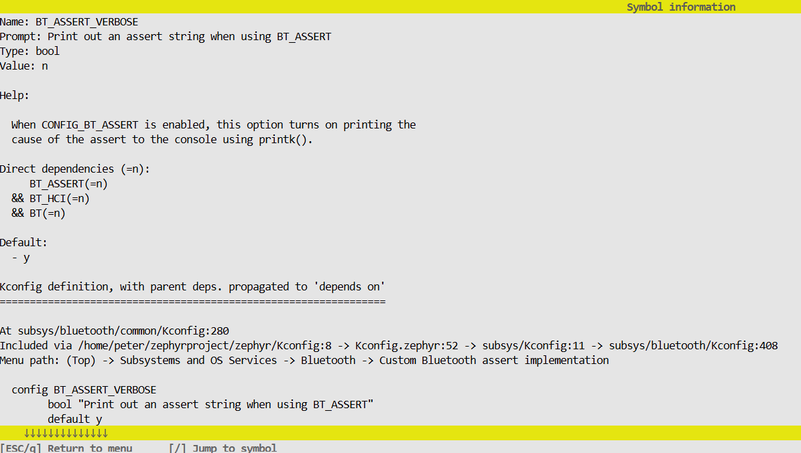
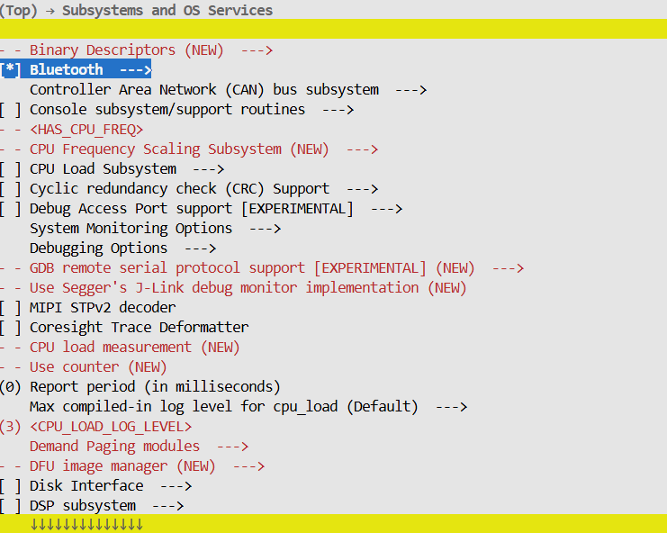
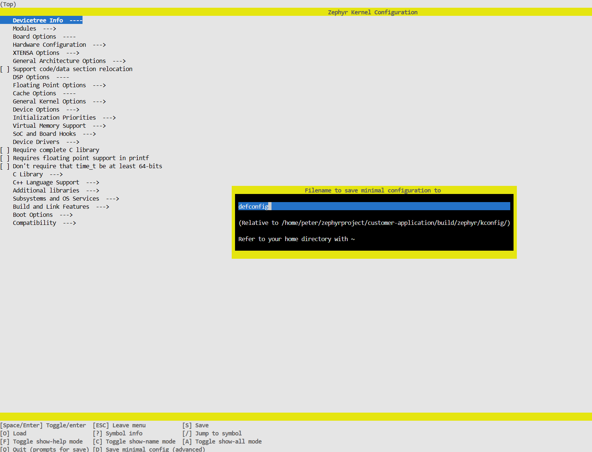
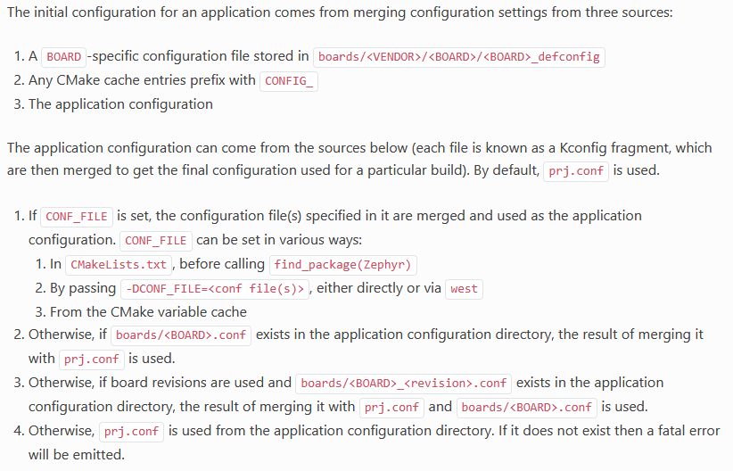

# Kconfig user guide for testers

### Table of Contents
1. [Zephyr application - home page](../README.md)
2. [Add new board to project](Add_new_board_to_project.md)
3. [Artifactory storage server](Artifactory_storage_server.md)
4. [GitHub workflow_dispatch panel](Github_workflow_dispatch_panel.md)
5. [HW resources for tests](HW_resources_for_tests.md)
6. Kconfig tester guide [this page]
7. [Raspi runner installation](Raspi_runner_installation.md)
8. [Shell tests with native_sim](Shell_tests_with_native_sim.md)
9. [Tests list](Tests_list.md)
10. [Tests user guide](Tests_user_guide.md)
11. [MCUmgr subsystem for testing purposes](MCUmgr_subsystem_for_testing_purpose.md)
12. [Simulation/emulation principles in testing](Simulation_emulation_principles.md)
13. [BLE terms, roles and definitions](BLE_terms_definitions.md)
---

The Zephyr kernel and subsystems can be configured at build time to adapt them for specific application and platform needs. Configuration is handled through Kconfig, which is the same configuration system used by the Linux kernel. The goal is to support configuration without having to change any source code. This guide will help you understand how the configuration setup with Kconfig symbols works and how to use it for enhancing a testing workflows.

For basic guideline about Kconfig see the official Zephyr documentation:  
[https://docs.zephyrproject.org/latest/build/kconfig/index.html](https://docs.zephyrproject.org/latest/build/kconfig/index.html)

<br/>

## Initial configuration ofZephyr application 

The initial configuration for an application comes from merging configuration settings from following three sources:

    - A BOARD-specific configuration file stored in boards/<VENDOR>/<BOARD>/<BOARD>_defconfig.
    - Any CMake cache entries prefix with CONFIG_  (e.g. prj.conf).
    - The application configuration (Kconfig hierarchy structure files).

<br/>

## Explore the kernel configuration system Kconfig 

Zephyr RTOS uses `CMake` as one of its build and configuration systems. On top of CMake - just like the Linux kernel - Zephyr uses the kernel configuration system `Kconfig`. Kconfig is a configuration system that uses a hierarchy of configuration files (with their own syntax), which defines a hierarchy of configuration options, also called `symbols`. The build system uses these symbols to include/exclude files from the build process and to manage the features/services to be built in the final source code (image) itself. Kconfig system allows you to modify your application without modifying the source code! This option lets the user (tester) to debug/find the demanded set of Kconfig symbols and verify the correct set of symbols are being used in the final build.

To explore all Zephyr RTOS Kconfig symbols you can use Kconfig Search online tool:
[Kconfig Search](https://docs.zephyrproject.org/latest/kconfig.html)

For basic debug proceeding with Kconfig configuration system in <strong>custom Zephyr application</strong> follow next steps:

<br/>

1\. Build the Zephyr application with the following command (example):

```c
west build -p always -b esp32s3_devkitc/esp32s3/procpu tests/repo_tests/shell
```

<br/>

2\. Update the application configuration options/symbols to get demanded outputs in build/ directory. You can reach it with 3 different ways:

* Manual update of application conf.prj/other Kconfig source files within application folder and re-build Zephyr application again.
* To explore and change the configuration options in build/ folder in text-format with `west build --build-dir build -t menuconfig` command (recommended).
* To explore and change the configuration options in build/ folder in GUI-format with `west build --build-dir build -t guiconfig` command.

<br/>

<strong>NOTE:</strong><br/>
In most cases when changing your Kconfig symbols in build/ application folder, you can simply `run west build` WITHOUT `--pristine` (-p) option and the build system will rebuild the appropriate source taking your Kconfig updates into account. The downside of saving the configuration to `zephyr/.config` in the build directory is that all changes will be lost once you perform a clean build with using west build `--pristine` option.

Don't use the option with GUI-format updates with `west build --build-dir build -t guiconfig` command in case of headless SSH connection or VSCode terminal because of the lack of GUI interface resources.

<br/>

3\. Start the text-based menuconfig interface (recommended) to explore and change the configuration options in build/ directory:

```c
west build --build-dir build -t menuconfig
```

Result:



<br/>

4\. Search for demanded symbol/option to be updated. You can use regex-pattern as well.

Example for "Bluetooth" symbols:



<br/>

5\. Once you have found the demanded symbol/option, you can change it by pressing `<Enter>` on the symbol. The symbol's panel will show the current value and the options available for the symbol.



<br/>

<strong>NOTE:</strong><br/>
What does `- -` mean in menuconfig?<br/>
The entries you're seeing in menuconfig with double hyphens (- -) at the beginning are not selectable directly 
because they are not currently available due to unmet dependencies or conditions in the Kconfig system.

	
	- - prefix: This indicates that the option is disabled and unavailable.
	Reason: Usually, this is because some parent configuration option or dependency is not enabled.

<br/>

6\. To find what parent configuration(s) should be changed for demanded symbol, you can press `<?>` on your keyboard to see the info-panel.
Check the "Direct dependencies" section for more details.



<br/>
To enablle/disable the demanded symbol dependend on parent's symbols you have to update the parents symbols first.

<br/>

7\. Once you find the demanded symbol and want to change its state, you have to press `<Space >` key to toggle the symbol's state - see an example:



<br/>  
  
## Seeing changes made by menuconfig
Above steps have the same final effect - updating the `build/zephyr/.config` file. To verify the changes made by menuconfig, you can use the following command (without `--pristine` (-p) option). If you would apply the `--pristine` (-p) option, you’ll lose menuconfig changes. So make sure you do an incremental build (just don’t use the pristine flag) to test those changes out. But eventually you will want to make them persistent.

```c
west build -b esp32s3_devkitc/esp32s3/procpu tests/repo_tests/shell
```

How to get the list of updated symbols with `west build --build-dir build -t menuconfig` command?

Running a build command on a Zephyr project pulls in configurations from all over the place (eg: the board’s default configuration from the Zephyr tree, the project’s prj.conf file, and any .conf files in the boards directory), what results to quite large list of symbols in `build/zephyr/.config` file. But luckily the `west build --build-dir build -t menuconfig` command before updateting the .config file makes a copy called `build/zephyr/.config.old` which we can compare using the diff command:

```c
diff build/zephyr/.config.old build/zephyr/.config

# This will output the lines that differ between file1.txt and file2.txt, using symbols like:

< for lines in the first file
> for lines in the second file 
```

<br/>  

## Save minimal configuration
Both menuconfig and guiconfig have the `Save minimal config` option. As the name implies, this option exports a minimal Kconfig file containing <strong>all symbols that differ from their default values.</strong> This does, however, also include symbols that differ from their default values due to other Kconfig fragments than your application’s configuration. E.g., the symbols in the Kconfig files of the chosen board are saved in this minimal configuration file.

<br/> 



<br/> 

Output file from Save minimal config is in

```c
{application}/build/zephyr/kconfig/defconfig
```

It is recommended to use this file content to export a minimal configuration file for your application and store it in 
`application/prj.conf` file. This way, you can easily share your configuration with others or use it as a starting point for your own application.

<br/>

## Kconfig hierarchy to use in Zephyr application test
Kconfig files are organized in a hierarchy structure.<br/>
- The top-level Kconfig file is `Kconfig` and it is located in the root directory of the Zephyr project.
- The Kconfig files in the `boards` directory are used to define the board-specific configuration options.
- The Kconfig files in the `tests` directory are used to define the test configuration options. 
- The Kconfig files in the `lib` directory are used to define the library configuration options.
- The Kconfig files in the `include/custom_lib` directory are used to define the custom library configuration options etc.

To simplify the configuration process for application's test case purpose the below mentioned approach can be used in most cases. For more advanced or specific configuration setup see another tutorials/guides available on internet. 

<br/> 


