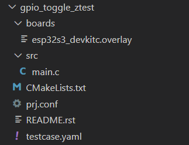

# Zephyr tests user guide

### Table of Contents
1. [Zephyr application - home page](../README.md)
2. [Add new board to project](Add_new_board_to_project.md)
3. [Artifactory storage server](Artifactory_storage_server.md)
4. [GitHub workflow_dispatch panel](Github_workflow_dispatch_panel.md)
5. [HW resources for tests](HW_resources_for_tests.md)
6. [Kconfig tester guide](Kconfig_tester_guide.md)
7. [Raspi runner installation.md](Raspi_runner_installation.md)
8. [Shell commands with native_sim.md](Shell_commands_with_native_sim.md)
9. [Tests list](Tests_list.md)
10. Tests user guide [this page]
---

This document will guide you through the process of adding and setting up Zephyr tests in the application. All application tests are stored under the `tests/` directory. Each test suite is a folder containing test cases. Each test case is a file with a `.py` or `.c` extension (based on test framework used for the test suite - Pytest, Ztest).

All tests cases in automated process are run in the default branch (main) of the repository with the command skeleton:<br/>

"west twister -vv --platform {platform} --detailed-test-id --device-testing --device-serial {device_serial} --flash-before"

To run test case manually on custom branch code use the GitHub Actions tab  `workflow_dispatch` event, where the additional parameters can be added to the command:<br/>

[https://github.com/pantoska-tieto/antoskape-project/actions/workflows/build.yml](https://github.com/pantoska-tieto/antoskape-project/actions/workflows/build.yml)

<br/>

## Test types used in this application
1. Ztest - Zephyr's built-in unit testing framework.
2. Pytest - Python-based testing framework.
3. Shell harness test - Zephyr's harness component of Twister FW matching shell output utilizing regex + Pytest.

<br/>

<strong>Shell harness test:</strong><br/>
The shell harness is used to execute shell commands and parse the output and utilizes the <strong>custom pytest framework</strong> and the pytest harness of twister. It is used to automate interaction with the Zephyr shell over a serial interface or similar transport. It sends commands and verifies the output using regex, making it ideal for functional testing of shell commands.

`type` keyword (under harness_config):<br/>
This keyword defines the parsing mode for the shell output. It can take values like:
- one_line – for matching single-line responses.
- multi_line – for matching multiple lines of output.

```
harness: shell
    harness_config:
      type: one_line
      shell_commands: &kernel_commands
        - command: "kernel cycles"
          expected: "cycles: .* hw cycles"
        - command: "kernel version"
          expected: "Zephyr version .*"
```

For more info about Shell harness see the official Zephyr documentation [Custom Shell module](https://docs.zephyrproject.org/latest/develop/test/twister.html)

<br/>

## How to add a new test

For basic guideline how to setup Zephyr tests in the application, see the official Zephyr documentation:  
[https://docs.zephyrproject.org/latest/develop/test/ztest.htmls](https://docs.zephyrproject.org/latest/develop/test/ztest.html)
<p>
Basic overview of sample/test folder structure including workflow for target board attributes verification can be found in <a href="documentation/Add_new_board_to_project.md">How to add a new board into Zephyr project</a> guide. 
</p>

<br/>


1\. Create new test suite folder under tests/ root sub-folder depending on test-type, for example `tests/repo_tests` for generic application test. Use a meaningfull folder  name. For example, `tests/repo_tests/ble_device_recognition` for BLE device recognition test case.

2\. Create the following structure of files in the test suite folder:<br/>
- `testcase.yaml` - test case configuration file, which contains test case details such as test name, tags, and other parameters.
- `sample.yaml` - test case configuration file, which contains build setup parameters + test case details [OPTIONAL - for samples where the separate Build and Testing process is demanded].
- `src/test.py` or `src/test.c` - test case file, which contains the test code.
- `proj.conf` - configuration file for the test suite, which contains the test suite parameters.
- `CMakeLists.txt` - setup file for compilation process.
- `README.*` - README.rst/README.md file with guidelines/setup recommendations or other important details related to test suite/test_cases.
- other folders/files as needed (e.g., `boards/`, `Kconfig` etc.).<br/>
<br/>

Example:



<br/>

Test suites stored in `tests/repo_tests/` folder are run in automated mode as generic application tests. To assign any test suite from `tests/` folder to specific test run (regardless of test suite storage folder) you can use a specific tag in `testcase.yaml`  or `sample.yaml` and key `tags:`. Afterwards the test suite can be called in `workflow_dispatch` event with applying this tag in `workflow_dispatch` event field "Test TAGs to filter tests". The same rule is applicable for "Test suite scenario to run" field.<br/>

<br/>
  
## How to setup the test

For basic guideline how to setup Zephyr tests in the application, see the official Zephyr documentation:  
[https://docs.zephyrproject.org/latest/develop/test/twister.html#tests](https://docs.zephyrproject.org/latest/develop/test/twister.html#tests)<br/>
<br/>

1\. Update Test Suite files as requested for demanded test. Pay attention to the crutial setup options like:<br/>
- Update `testcase.yaml` or `sample.yaml` file with reference for target device/board architecture to be tested on. For example to add ESP32 S3 devkitc board into test configuration, add `esp32s3_devkitc/esp32s3/procpu` to `platform_allow` section (see below example).
- Update `testcase.yaml` or `sample.yaml` file with demanded test framework to be applied in test run:  `harness: ztest` for Ztest, `harness: pytest` for Pytest (see below example).


```
tests:
  repo_tests.dut.gpio_toggle_ztest:
    platform_allow:
      - esp32s3_devkitc/esp32s3/procpu
      - esp32c3_devkitm
    tags:
      - gpio
      - integration
      - ztest
    harness: ztest
    integration_platforms:
      - esp32s3_devkitc/esp32s3/procpu
      - esp32c3_devkitm

```

​<br/>

2\. Add board overlay with external DTC file into the `boards/` folder if applicable - needed for the DUT board consists of a differences in HW/configuration which are not implemented in Zephyr yet. Overlay files are typically stored in<br/>

`tests/<test_suite>/board/<board name>.overlay (.conf)`​<br/>

files, where there are automatically recognized by Zephyr applications.<br/>

​<br/>

3\. Add a tag(s) to `tags:` section to be applied in GitHub workflow dispatch panel when running the tests with demanded tag-specification.

​<br/>

4\. Update the `prj.conf` file with generic configuration parameters. This file:<br/>
- defines build configuration options for your Zephyr application, sample, or test.
- uses the same syntax as Kconfig files (simple KEY=VALUE pairs).
- customizes which Zephyr features, drivers, and kernel options are enabled or disabled for that specific build/test run.​<br/>

For more detailed explanation how thw prj.conf file is used in build process and how to customize its content, see the document [Kconfig user guide for testers](Kconfig_tester_guide.md).

<br/>
Example - build configuration to get Bluetooth support:<br/>
<br/>

```
CONFIG_SYSTEM_WORKQUEUE_STACK_SIZE=2048

CONFIG_BT=y
CONFIG_LOG=y
CONFIG_BT_SMP=y
CONFIG_BT_SIGNING=y
CONFIG_BT_PERIPHERAL=y
CONFIG_BT_DIS=y
CONFIG_BT_ATT_PREPARE_COUNT=5
CONFIG_BT_BAS=y
CONFIG_BT_HRS=y
CONFIG_BT_IAS=y
CONFIG_BT_CTS=y
CONFIG_BT_CTS_HELPER_API=y
CONFIG_BT_PRIVACY=y
CONFIG_BT_DEVICE_NAME="TIETO Bluetooth"
CONFIG_BT_DEVICE_APPEARANCE=833
CONFIG_BT_DEVICE_NAME_DYNAMIC=y
CONFIG_BT_DEVICE_NAME_MAX=65
CONFIG_BT_KEYS_OVERWRITE_OLDEST=y
CONFIG_BT_SETTINGS=y
CONFIG_FLASH=y
CONFIG_FLASH_MAP=y
CONFIG_NVS=y
CONFIG_SETTINGS=y

```
<br/>

5\. Update the `CMakeLists.txt` file with build configuration options. Example:<br/>

```
cmake_minimum_required(VERSION 3.20.0)
find_package(Zephyr REQUIRED HINTS $ENV{ZEPHYR_BASE})
project(peripheral)

target_sources(app PRIVATE
  src/main.c
)
```
<br/>

6\. If test is executed on real hardare board and an additional hardware resources are utilized, update the guide [HW resources for tests](HW_resources_for_tests.md) to document the test prerequisites.<br/>

<br/>

## Notes  
1\. Never use a passwords hardcoded in test code! Use the GitHub secrets variables instead. 

For basic guideline how to use secrets in GitHub Actions, see the official documentation:  
[https://docs.github.com/en/actions/how-tos/write-workflows/choose-what-workflows-do/use-secrets](https://docs.github.com/en/actions/how-tos/write-workflows/choose-what-workflows-do/use-secrets)<br/>

<br/>

Example for Pytest workaround:<br/>

_conftest.py with generic fixtures - vars.json file consists of GitHub secrets variables exported to it within GitHub jobs:_

```
@pytest.fixture(scope="module")
def get_secrets(request):
    # Root path - pytest.ini location
    with open(os.path.join(request.config.rootpath, "vars.json"), "r") as f:
        return json.load(f)
```

<br/>

_Appying imported secrets in pytest test cases:_

```
@pytest.mark.dependency(name="scan")
def test_wifi_scan(get_secrets, dut: DeviceAdapter, shell: Shell):
    logger.info("Testcase: check available wifi SSIDs")
    shell.exec_command('wifi scan')
    lines = dut.readlines_until("Scan request done", timeout=20)
    assert any(get_secrets['PANT_SSID'].lower() in l.lower() for l in lines), "Scanning for demanded Wifi SSID failed!"
    logger.info("Wifi SSID was found.")  
```

<br/>

2\. Output files (in .zip format) from test run available for download in GitHub workflows (see Actions tab):

- _application_html_test_report_artifacts_ - HTML summary report of the test results in the actual workflow run.
- _summary_test_results_artifacts_ - detailed test results artifacts for tests (twister-out/ files from twister tool).
- _twister_out_json_files_artifacts_ - JSON files from test results for non-Robot tests (twister.json files from twister tool).
- _metadata_file_artifacts_ - metadata DB file for non-Robot tests (metadata.json with incremental content of all test runs).
- _application_tests_lists_artifacts_ - list of all tests in the repository (single line record in .txt format, content of testcase.yaml, sample.yaml for all available application tests in .json format).
- _twister_out_xml_files_artifacts_ - XML files from test results for non-Robot tests (twister.xml files from twister tool).